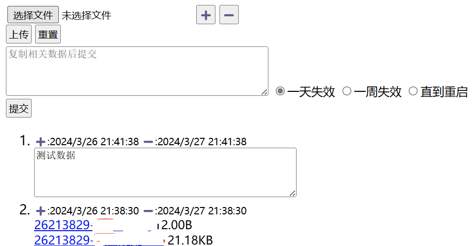

## 功能介绍

采用古老的js/vbs的ASP代码，用于临时使用，本人较为喜欢JS所以cb.asp为 jscript，但是有个上传组件使用的是vbs所以后端的cb目录用vbs

1. 用于临时转存文件和文本
2. 如下图
   1. 上传为转存文件，可以支持多个文件
   2. 提交为转存文本



## 使用方法

1. 需要windows的IIS服务和ASP功能

2. 需要手工创建临时文件目录，默认为相对目录

   ```
   cb/temp/
   ```
如果要修改地址，请修改 cb.asp文件中的如下内容修改文件路径

  ```
 var filePath = 'cb/temp/'   // 临时文件路径
  ```
和  cb/uploadResult.asp 文件中的
  ```
extList = "|ini|md|mp3|m4a|bmp|jpg|jpeg|png|zip|7z|rar|pdf|doc|docx|xls|xlsx|ppt|pptx|epub"
filePath= "./temp/"
  ```
4. 上面代码的 extList 表示允许上传的文件后缀清单，用 |文件后缀组成字符串

3. 访问入口文件为 cb.asp